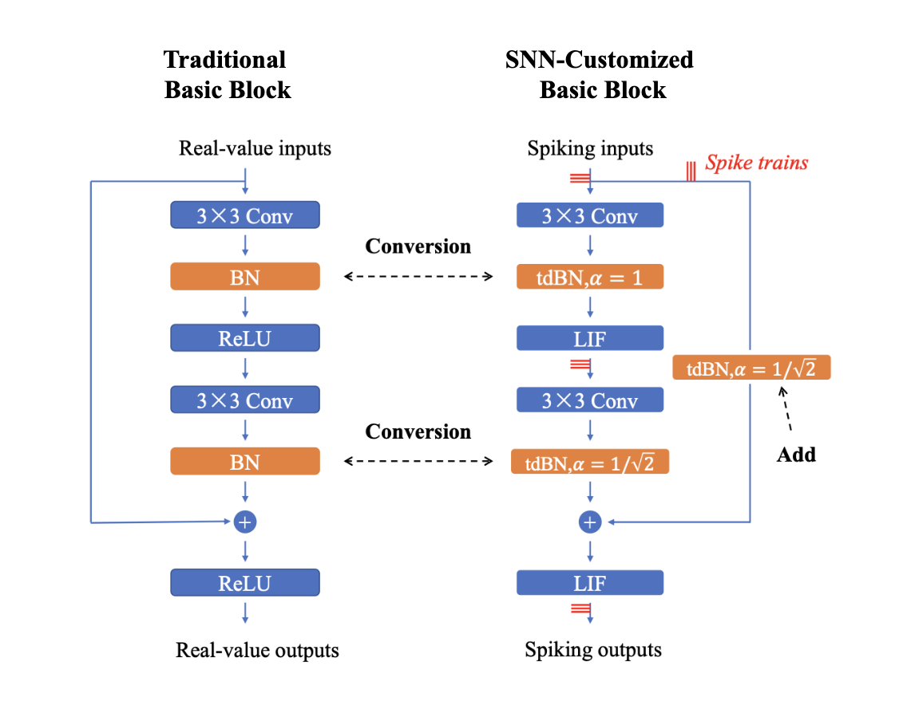
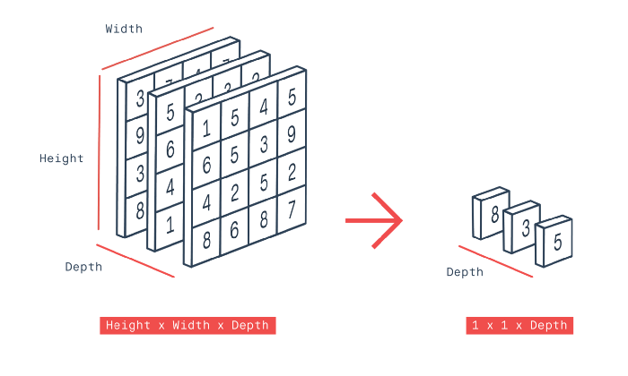
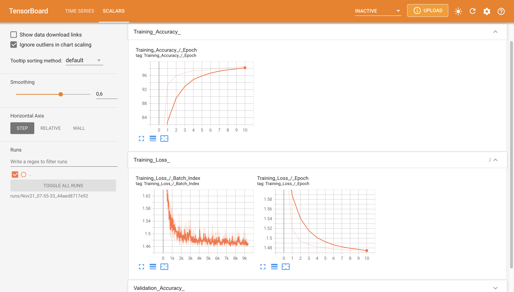
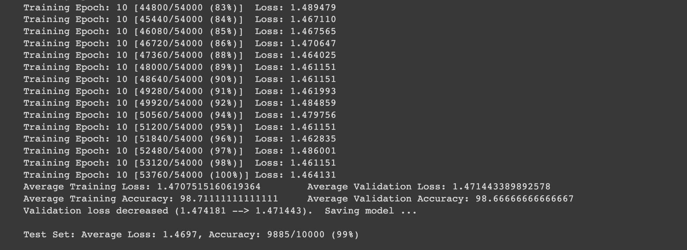
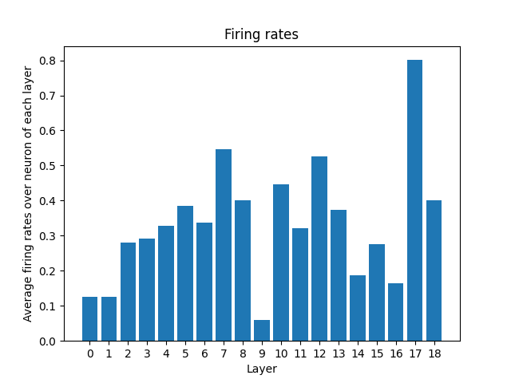

# A Direct Training Method for Deep Spiking Neural Networks
This project is a combination of a novel training method named Spatio-Temporal Backpropagation (STBP) and a Batch Normalization technique called threshold-dependent Batch Normalization (tdBN) together to make the training for Deep Spiking Neural Networks possible. The applied architecture is inspired by the $18$-layer ResNet and people sometimes call that Deep Spiking Residual Network (DSRN). Instead of using the standard Batch Normalization and normal Basic Blocks in ResNet, it uses tdBN and the customized Basic Block. A new spiking activation function with gradient approximation are also designed to describe brain-like behaviors and to make intermediate derivatives differentiable. With the usage of tdBN, the inappropriate firing rates from each neuron and vanishing or exploding gradients are addressed. Moreover, it also helps to reduce the [internal covariate shift](https://arxiv.org/abs/1502.03167) during training process, thus balancing the threshold and pre-synaptic inputs. A magnificient accuracy with [MNIST](https://en.wikipedia.org/wiki/MNIST_database) dataset ($98.67%$) is recorded after just $11$ epochs.

## Installation
* Create an environment using `conda create --name <env> --file requirements.txt`
* Main packages: `torch`, `tensorboard`, `pandas`, `numpy`

## Development Environment
* OS: macOS Ventura $13.0.1$
* Python $3.10.8$, Anaconda $22.9.0$
* Device: GPU Tesla T4 (Google Colab)

## How to run
* Run this command `python main.py --train_batch_size 64 --val_batch_size 200 --epochs 11 --lr 0.001`
* There are many arguments that can be changed when running in the terminal (Read more in the code, file `main.py`)

## Network Architecture
* Customized Basic Block
    * Acording to the idea from the paper $3$, we're going to use this customized Basic Block (on the right in the image below) when training Deep Spiking Neural Networks

<i>The customized Basic Block for SNNs.</i>

* tdBN normalizes the pre-activations to $N(0, V^{2}_{th})$
* Approximation derivative is a rectangular function
* Deep Spiking Neural Network Structure

|            19 layers            |                                                      |
|:-------------------------------:|:----------------------------------------------------:|
|              conv1              |              $3\times 3, 128$, stride=1              |
|             block 1             |   $\binom{3\times 3, 128}{3\times 3, 128}\times 3$   |
|             block 2             | $\binom{3\times 3, 256}{3\times 3, 256}^{*}\times 3$ |
|             block 3             | $\binom{3\times 3, 512}{3\times 3, 512}^{*}\times 2$ |
| average pool stride=2, 256-d FC |                                                      |
|         10-d FC, softmax        |                                                      |

$*$ means the first basic block in the series perform downsampling directly with convolution kernels and a stride of 2

The average pool layer takes an average over channels axis, see the image below:

<i>The Global Average Pooling Layer.</i>

## Training Settings

### Preprocessing
* The size of each image in MNIST dataset is $(28, 28)$ and I'm going to use these transforms:
    * `RandomHorizontalFlip`: Horizontally flip the given image randomly with a given probability (default: $0.5$).
    * `RandomCrop`: Crop the given image at a random location.
    * `Normalize`: Normalize a tensor image with mean and standard deviation.
* The customized MNIST has a transformation `ToTensor` already.

### Hyperparameters

| **Hyperparameters** |     **Values**     |
|:-------------------:|:------------------:|
| Timesteps `steps`   |          $2$         |
| Peak width `aa`     |         $0.5$        |
| Threshold `Vth`     |         $0.4$        |
| Decay factor `tau`  |        $0.25$        |
| Alpha `alpha`       | $\frac{1}{\sqrt 2}$ |
| #epochs             |         $11$         |
| Learning rate       |        $0.001$       |
| Adam betas          |    $(0.9, 0.999)$    |
| Adam epsilon        |        $10^{-8}$       |

### During Training

* Early Stopping is used to avoid overfitting. That is whenever the validation loss increases, the stopper counter increments by $1$ until the counter is equal to parameter `patience`, the training process is stopped.

## Experiments
* In this project, I just show an example experiment of training the customized $19$-layer ResNet (shown via tensorboard). With the hyperparameters set up in file `helper_layers.py` and by setting `epochs=11` and using Learning Rate Adjustment strategy (i.e. reducing the learning rate after an amount of epochs, in this case I picked $10$ for that amount). The training time is around $2$ hours.
* If you haven't installed `tensorboard`, type this command `pip install -U tensorboard` to install it. To run tensorboard, type this command in the terminal: `tensorboard --logdir runs/<folder including events file>`. By default, tensorboard will automatically write event files to a directory named `runs` in the current working directory.

<i>TensorBoard GUI.</i>

* The image below is the test loss and accuracy after finishing $11$ epochs:

<i>Test loss and test accuracy at the end of the training process.</i>

* Here is the firing rates when inferring a test sample. Run command `python test.py` to see the plot: 

<i>Average firing rates over neuron of each layer.</i>

* Some comments:
    * Note that there're $2$ types of neurons, which are convolution neurons and fully connected neurons. In this case, I'll consider both kinds as neurons and compute the average firing rates over them.
    * In layer $17$ (a fully connected layer), the average firing rate is the highest.

## Notes
* The model performance is extremely sentitive to $V_{th}$ and `aa` (the width parameter of the rectangular curve) so you need to take a careful choice of these $2$ hyperparameters.

## References
1. https://www.frontiersin.org/articles/10.3389/fnins.2018.00331/full#B41
2. https://arxiv.org/abs/1809.05793
3. https://arxiv.org/abs/2011.05280
4. http://d2l.ai/chapter_convolutional-modern/batch-norm.html#equation-eq-batchnorm
5. https://pytorch.org/vision/0.8/_modules/torchvision/models/resnet.html
6. https://arxiv.org/abs/1502.03167
